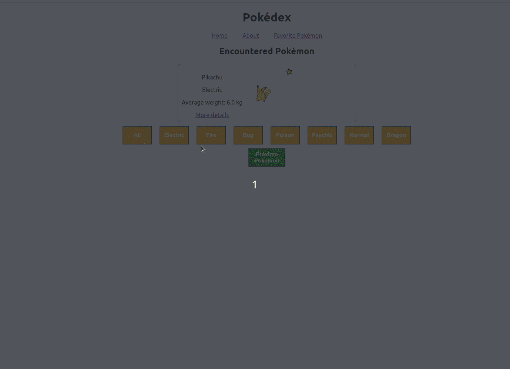

#  Pokémon App 


## 🌐 [](https://github.com/SamuelRocha91/pokedex/blob/main/README.md) [](https://github.com/SamuelRocha91/pokedex/blob/main/README_es.md) [](https://github.com/SamuelRocha91/pokedex/blob/main/README_en.md) [](https://github.com/SamuelRocha91/pokedex/blob/main/README_ru.md) [](https://github.com/SamuelRocha91/pokedex/blob/main/README_ch.md) [](https://github.com/SamuelRocha91/pokedex/blob/main/README_ar.md)



Добро пожаловать в **Pokémon App**, приложение, разработанное на React, которое отображает список покемонов, позволяет просматривать конкретные детали и отмечать любимых.

## Предварительные требования

Чтобы протестировать и запустить приложение, вам нужно настроить следующую среду:

- Node.js версии 18 или 16 (рекомендуется Node.js 18 для обеспечения совместимости с зависимостями).

### Проверьте версию Node.js

Чтобы проверить, установлена ли совместимая версия Node.js, используйте следующую команду:

```bash
node -v
```

Убедитесь, что вывод будет `v18.x.x` или `v16.x.x`. Если вам нужно установить или обновить Node.js, вы можете скачать его [здесь](https://nodejs.org/).

## Установка

Выполните следующие шаги, чтобы запустить приложение локально:

1. **Клонируйте репозиторий:**

   ```bash
   git clone https://github.com/ваш-пользователь/pokemon-app.git
   ```

2. **Перейдите в директорию проекта:**

   ```bash
   cd pokemon-app
   ```

3. **Установите зависимости:**

   Выполните следующую команду, чтобы установить все необходимые зависимости:

   ```bash
   npm install
   ```

4. **Запустите приложение:**

   После установки зависимостей, запустите приложение с помощью команды:

   ```bash
   npm start
   ```

   Это запустит сервер разработки. Откройте браузер и перейдите по адресу `http://localhost:3000`, чтобы увидеть приложение.

## Функциональность

- **Pokedex:** Отображает список покемонов с возможностью добавить в избранное.
- **Детали покемона:** Показывает подробную информацию о выбранном покемоне.
- **Избранные покемоны:** Страница, посвященная любимым покемонам.
- **Страница о нас:** Объясняет цель приложения.
- **Страница не найдена (404):** Появляется, когда запрашиваемая страница не существует.

## Структура проекта

Приложение структурировано следующим образом:

- **`/src`**: Содержит весь исходный код приложения.
  - **`/components`**: Повторно используемые компоненты.
  - **`/pages`**: Страницы приложения (Pokedex, Детали, Избранное, О нас и т.д.).
  - **`/types`**: Определения PropTypes для проверки props.
  - **`Routes.js`**: Определяет основные маршруты приложения.

## Тестирование

Чтобы убедиться, что приложение работает правильно, вы можете запустить автоматические тесты с помощью:

```bash
npm test
```

## Другие проекты

- ⚽ [Typescript FootBall API](https://github.com/SamuelRocha91/trybeFutebolClube/blob/main/README_ru.md)
- 🐉 [Trybers and Dragons](https://github.com/SamuelRocha91/trybeAndDragons/blob/main/README_ru.md)
- 🌶️ [Recipes App](https://github.com/SamuelRocha91/ProjectRecipesApp/blob/main/README_ru.md)
- 🏪 [FrontEnd Online Store](https://github.com/SamuelRocha91/trybeFutebolClube/blob/main/README_ru.md)
- 🎮 [Trivia](https://github.com/SamuelRocha91/trivia_game/blob/main/README_ru.md)
- 🌌 [Star Wars Planets](https://github.com/SamuelRocha91/ProjectRecipesApp/blob/main/README_ru.md)
- 🪧 [Blogs Api](https://github.com/SamuelRocha91/BlogsApi/blob/main/README_ru.md)
- 👛 [Expense organizer](https://github.com/SamuelRocha91/project-trybewallet/blob/main/README_ru.md)
- 🗡️ [Trybe Smith](https://github.com/SamuelRocha91/TrybeSmith/blob/main/README_ru.md)
